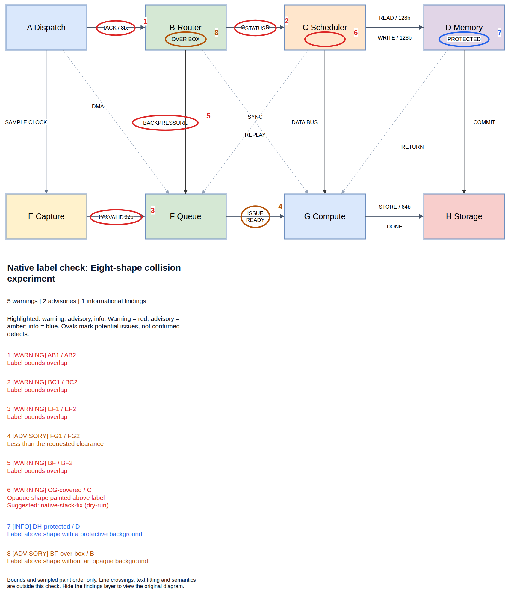
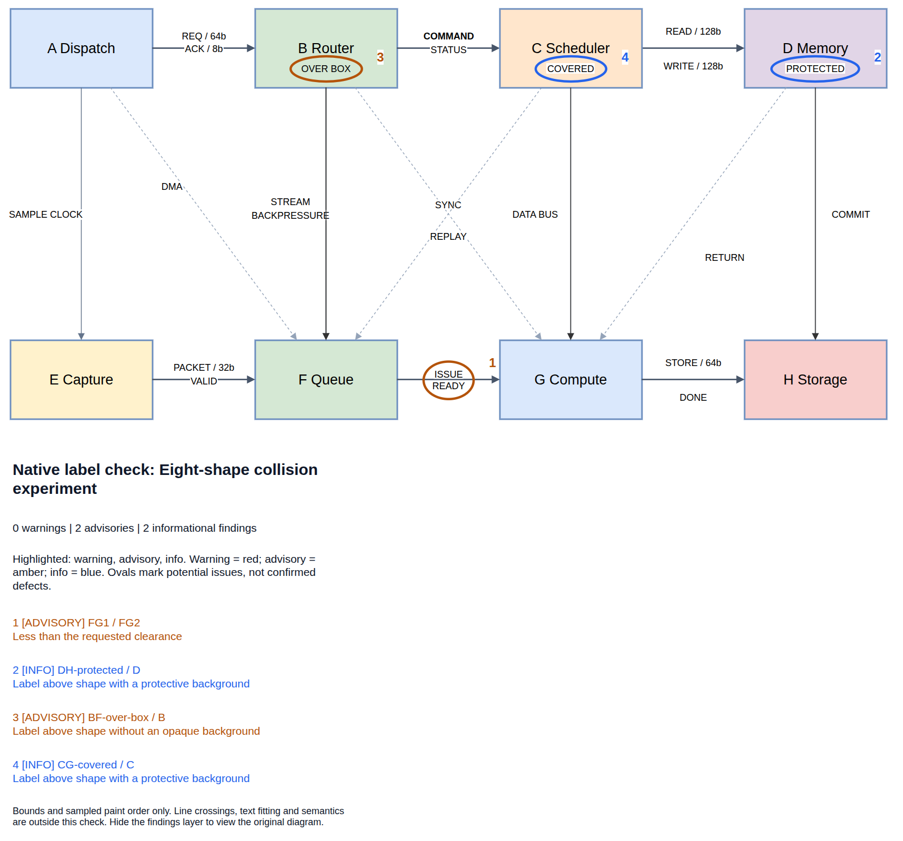

# Draw.io Python Skill

A self-contained [Agent Skills](https://agentskills.io/specification) package for generating and editing native, editable Draw.io diagrams with Python. It focuses on SoC architecture and microarchitecture and also supports flowcharts, schemas, swimlanes, networks, and illustrations built from native shapes.

The bundled API provides shapes, ports, containers, layers, multiple pages, deterministic connectors, tables, metadata, structural validation, and targeted edits to existing diagrams. Connector routing is explicit; generation does not automatically avoid obstacles or measure text.

Dense diagrams can be structurally valid but hard to read: connection labels overlap each other, sit too close together, or disappear behind shapes. Structural validation alone cannot detect these rendering problems.

The optional **native checker** uses Draw.io's renderer to measure label bounds and inspect paint order, then highlights potential issues with numbered ovals and explanations. Two independent **automatic fixers** address supported cases: one adjusts label offsets, and the other raises an edge above a shape hiding its label. Both preserve text, styles, shapes, routes and connections, verify the saved result, and leave cases they cannot safely repair for review.

The example below has eight shapes and 24 labeled connections, with deliberate defects. Checking the [original editable diagram](docs/native-label-check.drawio) finds five warnings, two advisories and one informational overlap. **Red = warning, amber = advisory, blue = info.** An oval marks a finding for review, not necessarily a defect.



After both fixers run, the overlapping labels are separated and the hidden label is visible. Rechecking the [fixed editable diagram](docs/native-label-check-fixed.drawio) finds zero warnings, two advisories and two informational findings:



Reproduce both images and the fixed diagram from the original source:

```bash
python3 docs/regenerate-native-label-check.py --headless
```

The [script](docs/regenerate-native-label-check.py) runs stacking repair before offset repair. It replaces the generated artifacts in `docs` only after rendering succeeds; use `--output-dir /tmp/drawio-docs` for a separate destination. Exit 0 means no warnings or unmeasured labels remain, 1 means a verified partial result was generated, and 2 means generation failed.

## Install and use

The repository root is the complete skill package. Install it directly into your agent's skills directory, using `drawio-python-arch` as the local directory name to match the skill metadata:

```bash
mkdir -p "$HOME/.agents/skills"
git clone https://github.com/ripopov/drawio-python-skill.git \
  "$HOME/.agents/skills/drawio-python-arch"
```

For other agents, use their supported skills directory. Keep the whole repository together so scripts, references, and examples remain available.

Update an installed clone with:

```bash
git -C "$HOME/.agents/skills/drawio-python-arch" pull --ff-only
```

Run that command before starting your agent, or schedule it on each machine for automatic updates.

Ask your agent to use `drawio-python-arch`, for example:

> Use drawio-python-arch to create an editable CPU and memory diagram with an AXI4 interconnect. Save it as design.drawio.

Requirements:

- Python 3.9+; no pip dependencies.
- Draw.io Desktop for PNG export and renderer assets; Xvfb for headless Linux export.
- Chromium/Chrome for native checks and automatic fixes.

For PNG commands, omit `--headless` when a display is available. Add `--no-sandbox` only where the browser sandbox cannot run; use `--help` for explicit renderer paths.

Install on **Ubuntu 22.04/24.04 (`amd64`)**:

```bash
sudo apt update
sudo apt install -y python3 git curl ca-certificates xvfb xauth fonts-liberation snapd
sudo snap install drawio

# Chrome
drawio_deps_dir="$(mktemp -d /tmp/drawio-deps.XXXXXX)"
chmod 755 "$drawio_deps_dir"
curl -fL https://dl.google.com/linux/direct/google-chrome-stable_current_amd64.deb \
  -o "$drawio_deps_dir/google-chrome.deb"
sudo apt install -y "$drawio_deps_dir/google-chrome.deb"
```

For Snap, add `--drawio-asar /snap/drawio/current/resources/app.asar` to native checks, fixers and the documentation script. Snap PNG export is unverified; confinement may block temporary or hidden paths used by reports.

## Package contents

```text
drawio-python-arch/
├── SKILL.md       # Agent instructions and standard YAML metadata
├── scripts/       # Self-contained Python API and CLI
├── references/    # API documentation and verification notes
├── examples/      # Generators, prompts, editable diagrams, and previews
├── docs/          # Before/after diagrams, illustrations and regeneration script
└── tests/         # Standard-library unittest suite
```

Read [SKILL.md](SKILL.md) for the agent workflow and the [API reference](references/api.md) for direct Python use.

## Run examples and checks

From the repository root:

```bash
python3 examples/generate.py --output-dir /tmp/drawio-demo
python3 scripts/drawio_arch.py inspect /tmp/drawio-demo/axi_test_system.drawio
python3 -m unittest discover -s tests -v
```

Export a PNG:

```bash
python3 scripts/drawio_arch.py export /tmp/drawio-demo/axi_test_system.drawio /tmp/drawio-demo/axi_test_system.png --headless
```

Get a native check as JSON:

```bash
python3 scripts/drawio_arch.py native-check /tmp/drawio-demo/axi_test_system.drawio
```

Add a visual report:

```bash
python3 scripts/drawio_arch.py native-check /tmp/drawio-demo/axi_test_system.drawio \
  --report-dir /tmp/axi-visual-report --headless
```

Use a new output directory. It contains `report.json`, `annotated.drawio` with a separate editable findings layer, and one PNG per checked page. JSON includes label IDs, bounds, reasons and `highlight_color`. All severities are highlighted by default; `--highlight warning` or `--highlight warning,advisory` filters the illustrations without hiding findings from JSON or changing the failure threshold.

Warnings affect the default checker exit code; `--fail-on advisory` enables a stricter threshold. See [native checking](references/native-check.md) for collision rules and exit codes, and [verification notes](references/verification.md) for tested features and limits.

Run either fixer without `--output` for a verified dry-run, or save to a new file:

```bash
# Label offsets
python3 scripts/drawio_arch.py native-fix design.drawio --output design-fixed.drawio

# Stacking (suggested by occlusion warnings)
python3 scripts/drawio_arch.py native-stack-fix design.drawio --output design-stacked.drawio
```

Checks and fixers leave the source unchanged. Use `--keep ID` to protect cells and `--only ID` to select labels for repair. See [offset repair](references/native-fix.md) and [stacking repair](references/native-stack-fix.md) for safety checks, supported cases, receipts and generator updates.
